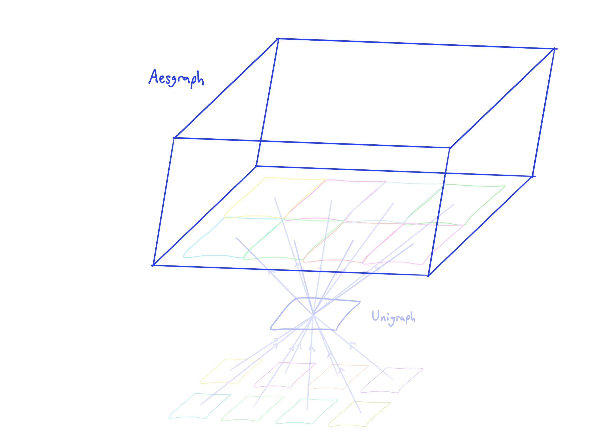

Large Concept
{: .label .label-blue }

**Aesgraph is a field-theoretical framework for interpreting and interacting with information.** 
**Aesgraph is a graph engine tailored to solve problems found across organizational complexity.** 
**Aesgraph is a human-centric operating system that revolutionizes communication.** 

Aesgraph will be built on top of [Unigraph](../overview.md).

The transition from Unigraph to Aesgraph will happen gradually. 

Unigraph aims to combine the best of Obsidian, VSCode, and Copilot into a single product for graph-based ideation, modeling, visualization, and analytics. 

Unigraph sees itself as becoming an indespensible tool for data scientists, educators, and students, and many others. Unigraph aims to become an "IDE for analytics" by unifying graph-based technologies through a standard language and framework.

Unigraph offers a new paradigm for how humans represent and interpret information, with an unprecedented degree of accessibility.

Aesgraph can be separated into layers:
- Structural Layer
- Semantic Layer
- Permissioning Layer
- Representation and Interaction Layer
- Computational Layer
- Application Layer