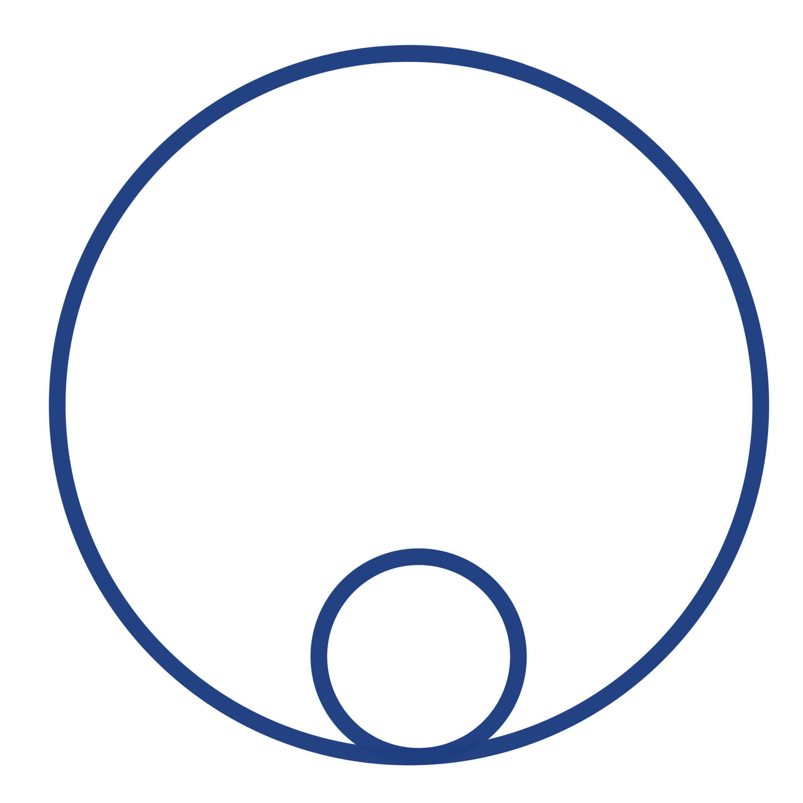

        
# Welcome to Unigraph 🚀 
 
<!-- {: width="64" height="64"} -->
<iframe src="https://unigraph.vercel.app" width="100%" height="600px" style="border: none;"></iframe>

## Quick Links
**Live Demo**: [https://unigraph.vercel.app](<https://unigraph.vercel.app>) 
**Repository**: [https://github.com/aesgraph/unigraph](<https://github.com/aesgraph/unigraph>) 
**Discord**: <https://discord.gg/8MxDDNjvsq> 
Chrome Extension: [Coming Soon]

{: .highlight }
⚠️ This project is under active development and far from complete. Please consider all presented material a work-in-progress towards an mvp.

{: .highlight }
⚠️ The app embedded in this webpage is cut off on the right side, the css needs to be updated.

Unigraph is both a deep technology, and an attempt to materialize it. It aims to productize itself as a means to build interest and community, but its final intention is far beyond. It aims to build a field-theoretic framework for application ecosystems centered on human-centric graph-based modeling, interaction, and information exchange.

Unigraph's first aim is to create an accessible platform for graph-based application software and information exchange. 
**The MVP centralizes accessibility to various existing diagramming tools in a single state-of-the-art web application.**

[Go to Overview](./overview/overview.md)

    
    