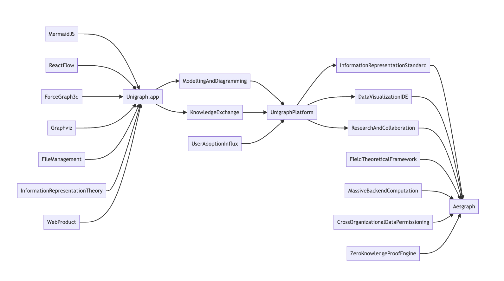

## Motivation

Modeling and representing complex systems is essential for knowledge exchange, yet no universal standard exists. While graph-based thinking is widely used across disciplines, the development of comprehensive, adaptable software for system diagramming remains an open challenge. Unigraph seeks to address this gap by providing a flexible, standardized framework for graph-based information representation and sharing.

Graph-based diagramming is a fundamental tool for communication, yet existing solutions are often built for specific functions, limiting their extensibility and interoperability. Many graph-based applications share core behaviors but remain siloed due to domain-specific constraints. Unigraph aims to unify this space by providing a standardized framework for graph-based application development and information exchange. Much like web frameworks such as React have streamlined development and established conventions for web applications, Unigraph seeks to do the same for graph-based systems—accelerating development, enhancing compatibility, and fostering a more cohesive ecosystem.

_a quickly-made diagram_

### Graph-based Web Libraries
#### Diagramming Tools
[MermaidJS](<https://mermaid.live/edit>) 
[Graphviz](<https://graphviz.org/>) 

#### Rendering and Interaction Libraries
[ReactFlow](<https://reactflow.dev/examples>) 
[ForceGraph2d](<https://github.com/vasturiano/react-force-graph>) & [ForceGraph3d](<https://github.com/vasturiano/3d-force-graph>) 
[SigmaJS](<https://www.sigmajs.org/>) 
[Cytoscape](<https://js.cytoscape.org/>) 

### Graph-based Web Applications: pre-Unigraph
Despite the shared behaviors and functionalities among these tools, they have been developed independently, leading to significant duplication of effort. Moreover, they often lack the flexibility needed for seamless integration into larger systems. Unigraph aims to establish a common framework for the client-side, enabling interoperability across graph-based applications and fostering a more cohesive ecosystem.

_Examples_

<u>Web Apps</u> 
_[Graph Based]_ 
[MermaidJS](<https://mermaid.live/>) 
[GraphvizOnline.1](<http://www.webgraphviz.com/>) 
[GraphvizOnline.2](<https://dreampuf.github.io/GraphvizOnline/>) 
[CytoscapeJS](<https://web.cytoscape.org/>) 
[Gephi-lite](<https://gephi.org/gephi-lite/>) 

_[Graph-adjacent]_ 
[Excalidraw](<https://excalidraw.com/>) 

<u>Services</u> 
[Kumu.io](<https://kumu.io/>) 
[Loqseq](<https://logseq.com/>) 
[Neo4j Sandbox](<https://neo4j.com/sandbox/>)

