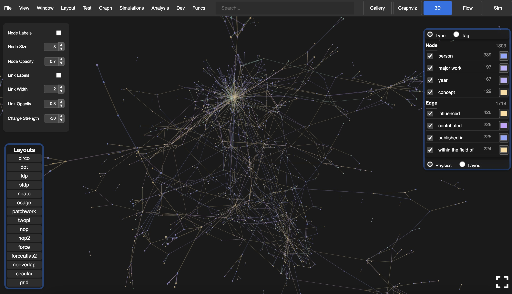
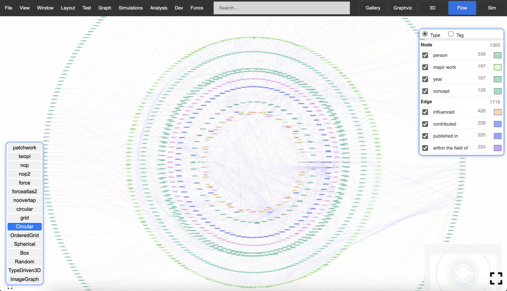

# Unigraph

**Unigraph is a human-centric graph model engine, application library, and information exchange platform.** **Unigraph is a general solution for web-based client-side interaction with Graphs.**

**Unigraph provides first-class mechanisms for managing display scenes independently from the underlying graph** **model, allowing for highly flexible and interactive representations of structured data.**

**Unigraph aims to provide a field-theoretical framework for graph-based applications and information exchange.** **Unigraph is both a developer library and a complete product.**

|  |  |

_OKRs_

- Unigraph has the largest and most complete feature set of any web-based graph interaction product.
- Unigraph provides programmatic and no-code environments for fully-featured graph construction, inspection, visualization, filtering, layouting, analysis, file management and sharing.
- Unigraph offers a formal language, framework, and standard for graph-based information representation and analysis.

_Restatements of its aims:_

- Unigraph aims to be an intermediate representation language and protocol that can connect independently developed graph-based libraries and applications, and compose higher-level applications and products.
- Unigraph extends existing graph-based technologies into a single unified product for working with spatial and structured information.

_Focuses:_

- [Composability in Unigraph](../coreConcepts/coreConcepts.md)
- Unigraph is good for navigating human-centric information that is high dimensional and has high connection density.
- Unigraph is a complete product in itself, is entirely web-based, and does all processing client-side.

_Benefits of this product that sets it apart from others:_

- Graph model construction and sharing platform that is immediately accessible to anyone
- Graph model consistency and validity check machine
- Graph format converter and enhancement tool

_Motivation:_

Modeling and representing complex systems is essential for knowledge exchange, yet no universal standard exists. While graph-based thinking is prevalent across disciplines, the development of comprehensive, adaptable software for system diagramming remains an open challenge. Unigraph seeks to address this gap by providing a flexible, standardized framework for graph-based information representation and sharing.

_Specific offerings:_

Unigraph provides first class workflows for creating "scenes" of complex high dimensional data so that they are more interpretable. It achieves this by offering robust management of layouts, filters, and graph rendering options that can be interchanged on the same underlying graph model. Furthermore, Unigraph emphasizes composability so that various users may combine graphs and scenes that were independently developed, and downsample into more manageable projections.

**Unigraph is the first step towards [Aesgraph](https://quip.com/W58VAJDPGbUb).**
