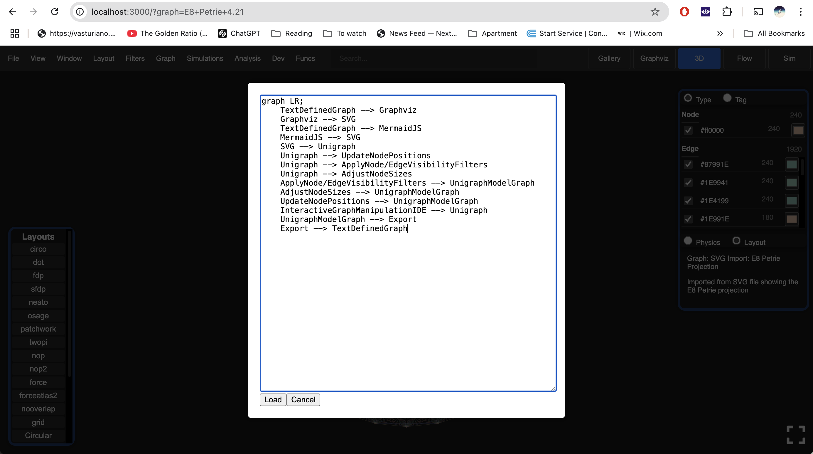
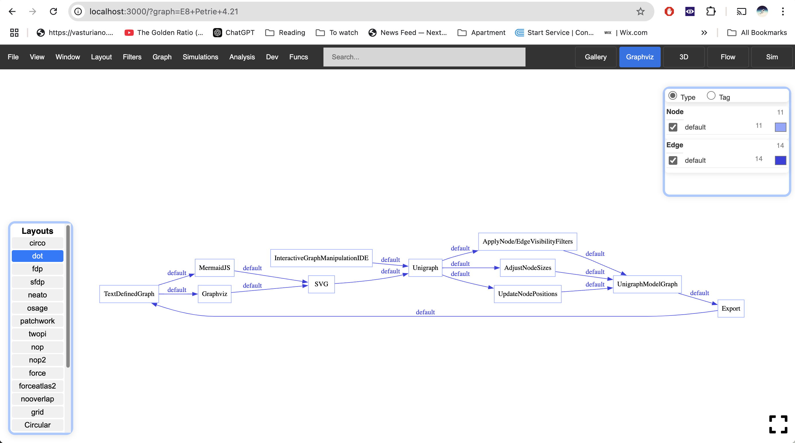

### Import Graphviz Dot into Unigraph

You can load Graphviz Dot diagrams into Unigraph for enhanced inspection and interaction.

You can quickly [create Graphviz Dot diagrams online](<https://dreampuf.github.io/GraphvizOnline>).

You can load the Text-Defined Graph into Unigraph for more advanced interaction features.
You can modify the graph further in Unigraph, and then export it.

<!-- 

 -->
