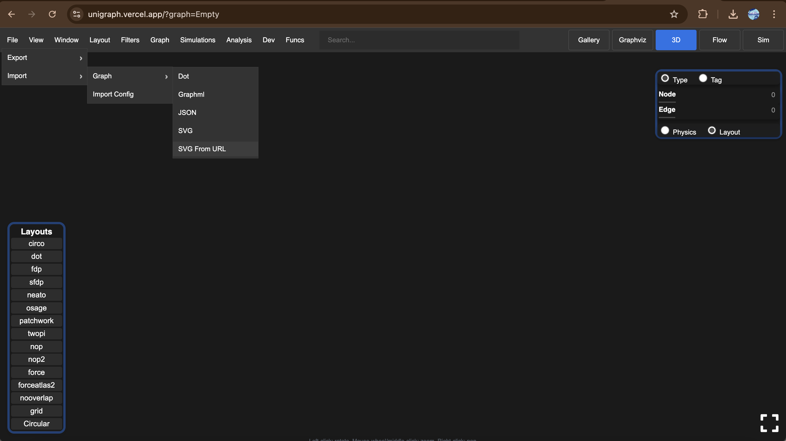
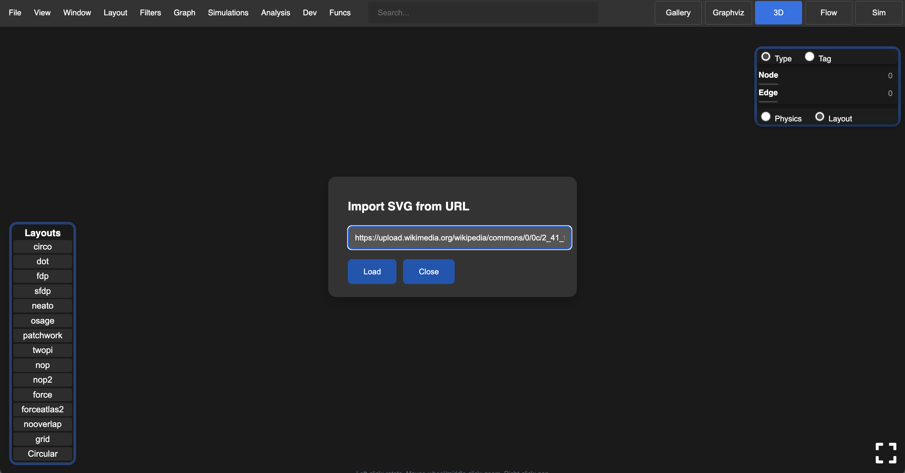
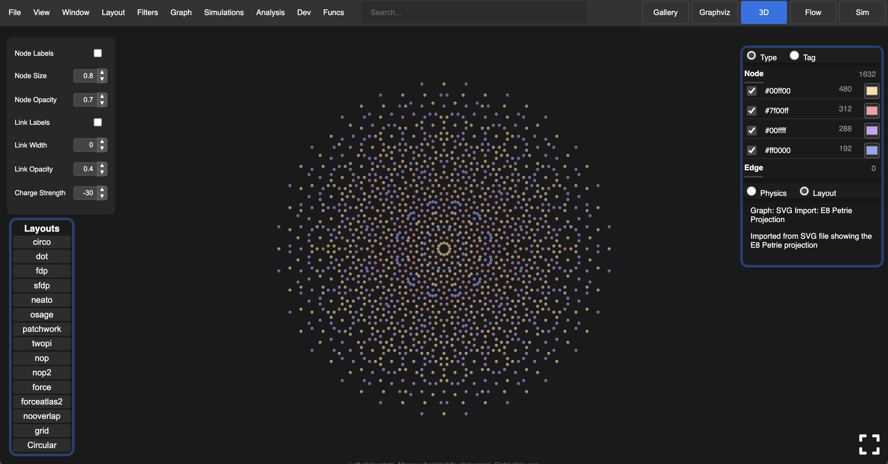
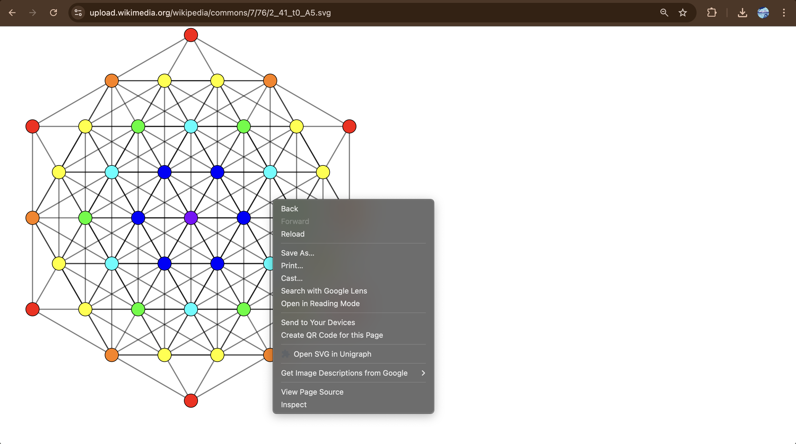
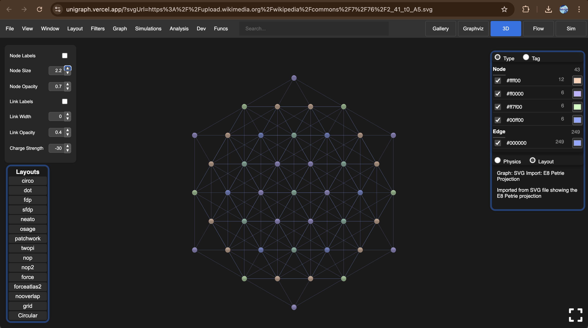

### Load SVG files directly into Unigraph

You can load certain SVG files directly into Unigraph for inspection and interaction.

For example, [Wikipedia: E8 Polytope Geometries](<https://en.wikipedia.org/wiki/E8_polytope>) is a collection of SVGs of orthographic projections of uniform polytopes with E8 symmetry. You can load these SVGs directly into Unigraph like so:

### Chrome Extension (Coming Soon)
Alternatively, you can Install the Chrome Extension and Right Click on an SVG Element to "Open in Unigraph"

