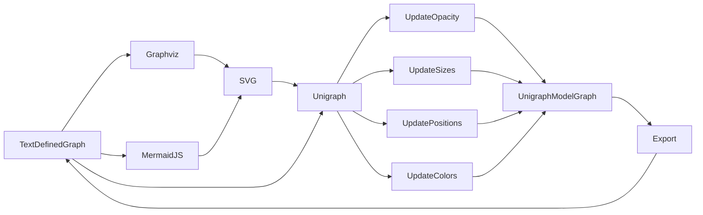

## Getting Started with Unigraph

There are several ways Unigraph can be used immediately.

## Demos

### Read from graphviz or mermaidjs, edit in browser, save or export [in progress]

Unigraph is a central application that allows importing, editing, and exporting of Graphs between various other Graph-based tool formats. The first focus of Unigraph is to offer enhanced inspection and interaction tools for Graphs. Existing tools like graphviz or mermaid js are not built for dynamic interaction and UI-based editing. Furthermore, they struggle to scale with entity count and connection density.

**Diagram of Workflow in MermaidJS**

**Import MermaidJS Diagram and Interactively Edit in Unigraph View:** React Flow **FULLY INTERACTIVE**

<iframe src="https://unigraph.vercel.app/?graph=graphManagementWorkflowDiagram&view=ReactFlow&layout=dot&showOptionsPanel=false&showGraphLayoutToolbar=false&showLegendBars=false&showRenderConfig=false&showToolbar=false" width="100%" height="600px" style="border: none;"></iframe>

**Export edited graphs to various file extensions or SVGs**
Graphviz View

<iframe src="https://unigraph.vercel.app/?graph=graphManagementWorkflowDiagram&view=Graphviz&layout=dot&showOptionsPanel=false&showGraphLayoutToolbar=false&showLegendBars=false&showRenderConfig=false&showToolbar=false" width="100%" height="600px" style="border: none;"></iframe>

The diagram shown above could be a display preset of a much larger graph that is fully navigable and configurable.
**Unigraph supports building and visualizing arbitrarily complex graphs.** 
Here is a collection of various diagrams (partially AI-generated) regarding Unigraph loaded into the same scene. In the future, Unigraph could be a mechansim to merge many complicated system descriptions together, with strong typing and built-in display and navigation features.

<iframe src="https://unigraph.vercel.app/?graph=graphManagementWorkflowDiagram2&view=ReactFlow&layout=dot" width="100%" height="600px" style="border: none;"></iframe>
<iframe src="https://unigraph.vercel.app/?graph=graphManagementWorkflowDiagram2" width="100%" height="600px" style="border: none;"></iframe>

**A future experiment: Use Unigraph with Copilot to self-describe and extend itself**

### Unigraph, Copilot, and the Semantic Web

**Connect to the semantic web and load ontology and knowledge graphs into Unigraph [coming soon]**

Unigraph will support loading in graphs from the semantic web using the semantic query panel, from sources like dbpedia.
It can be used as an interactive client for navigating the semantic web.

**Copilot functionality: IDE-based Copilot editing of Graphs [coming soon]**

Unigraph will offer an Copilot-enabled IDE for working with Graphs and SceneGraphs.

### Load Wikipedia articles and data into Unigraph [coming soon]

Unigraph will offer a basic sub-application for importing wikipedia articles as graphs. The larger vision is that Unigraph can act as a plugin to enhance Wikipedia exploration, similar to the Preview Card feature when links are mouse-hovered, but much more high powered.

### Embed Unigraph applets into your own website [in progress]

This is already possible by simply wrapping the unigraph application at [https://unigraph.vercel.app](https://unigraph.vercel.app) in an iframe. There are some query parameters to configure its state directly via url, which is how all of these interactive demos are being displayed. There are plans to connect a lightweight backend to Unigraph so users may save and share custom graphs online. There is more work to be done on the configurability of Unigraph as a webapp.

### Data structure visualization, semantic and structural type matching, and CRDTs [waiting on dependencies]
