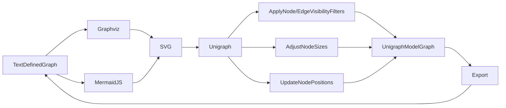

## Getting Started with Unigraph

There are several ways Unigraph can be used immediately.

## Demos

### Read from graphviz or mermaidjs, edit in browser, save or export [in progress]

Unigraph is a central application that allows importing, editing, and exporting of Graphs between various other Graph-based tool formats. The first focus of Unigraph is to offer enhanced inspection and interaction tools for Graphs. Existing tools like graphviz or mermaid js are not built for dynamic interaction and UI-based editing. Furthermore, they struggle to scale with entity count, and connectivity density. 

### Connect to the semantic web and load ontology and knowledge graphs into Unigraph [coming soon]
Unigraph will support loading in graphs from the semantic web using yasgui, from sources like dbpedia.

### Copilot functionality: IDE-based Copilot editing of Graphs [coming soon]
Unigraph will offer an Copilot-enabled IDE for working with Graphs and SceneGraphs.

### Load Wikipedia articles and data into Unigraph [coming soon]
Unigraph will offer a basic sub-application for importing wikipedia articles as graphs. The larger vision is that Unigraph can act as a plugin to enhance Wikipedia exploration, similar to the Preview Card feature when links are mouse-hovered, but much more high powered.
