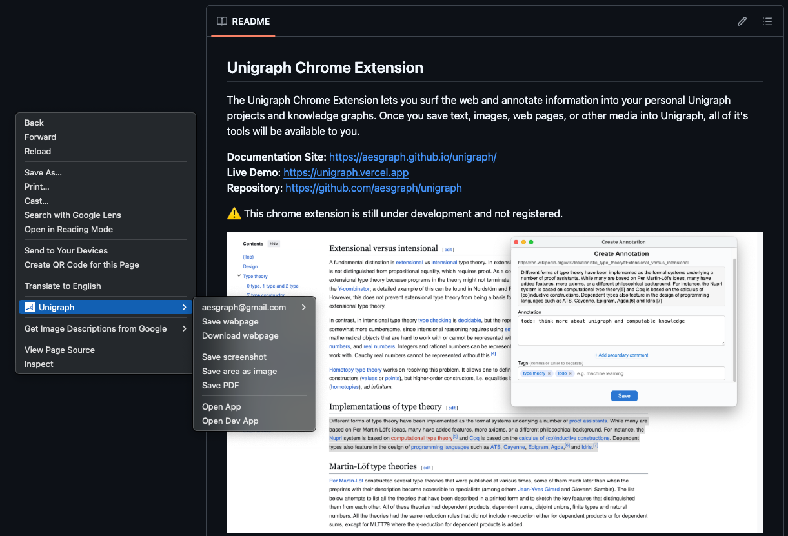
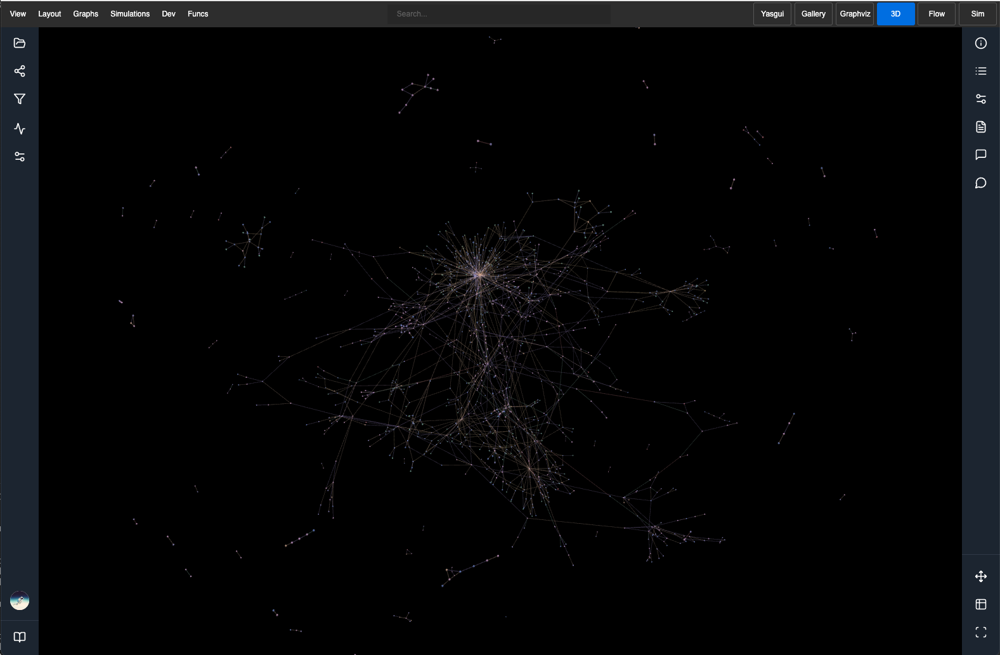

The Unigraph Chrome Extension enables users to save, annotate, and connect information across the internet into personal knowledge graphs. Web content saved to Unigraph are first-class entities and immediately functional in Unigraph's powerful application ecosystem.

Some of the things you can do in Unigraph with saved web content:

- Browse, search, edit, and tag content.
- Analyze web content using Copilot or Unigraph's type-theoretic tools.
- Build applets or computational workflows that act on your data.
- Use the web content to create information objects shareable with other users.

### **Example Use Cases**

**Basic**

- Annotating academic papers and linking them to your research topics.
- Capturing quotes and insights from news articles and debates, and linking them together.
- Bookmarking GitHub issues or StackOverflow answers with rich metadata for future reference.

**More Advanced User Journeys**

- A user wants to research a particular topic and also create a compounding asset that can be shared and extended. They can save and annotate various articles on the web into Unigraph and create static, interactive, or computable objects. Unigraph also provides capabilities to ingest information from the web directly into the application, like a Copilot-assisted Semantic Web Query Tool.
- A teacher assigned readings to a class of students. Using Unigraph and the chrome extension (and eventually desktop plugin), students can comment or ask questions on specific sections. Everyone can read and respond to each other over the Unigraph layer, and these comment trees become a compounding asset that can be composed with other Unigraph artifacts.
- A software engineer is studying system design and ingests various designs and diagrams across the internet into a Unigraph project to create an 'ultimate diagram' that could not be captured in one static image or article.

### **Screenshots**

### **Current Functions**

| Function           | Description                                                  |
| ------------------ | ------------------------------------------------------------ |
| Save webpage       | Save the link, a screenshot, and the HTML content by default |
| Download webpage   | Download the webpage as a single HTML file                   |
| Save annotation    | Annotate text or images on the page                          |
| Save screenshot    | Capture a screenshot of the current page                     |
| Save area as image | Draw a box to capture and save a specific area as an image   |
| Save PDF           | Save the current page as a PDF                               |

Content can be saved with annotations (primary comment), a secondary comment, and tags.
Annotations can be managed in Unigraph and annotations can be attached to other annotations.

### **Installation**

Aesgraph does not currently have an official version of the Unigraph Chrome Extension that integrates into its stack, meaning users must have their own Unigraph stack and supply the appropriate credentials to UCE. Aesgraph is working on releasing a version that integrates into the Unigraph stack it currently hosts.

Instructions to install are available in the github project:
https://github.com/aesgraph/unigraph-chrome-extension
