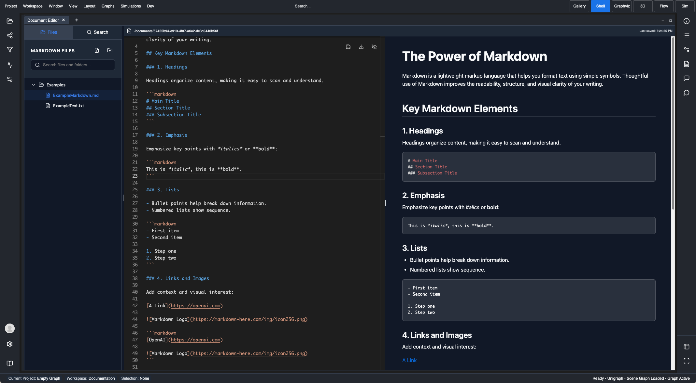
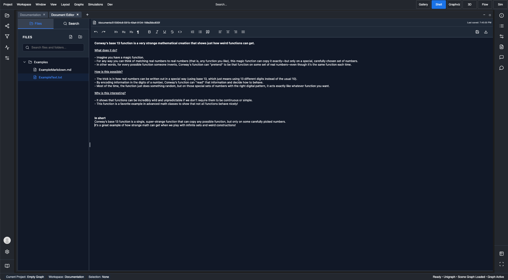

Unigraph has built-in Markdown and Rich-text editing with server-side storage.
Users can manage notes and file trees within their profile, and integrate their work into Unigraph's application ecosystem.

Attention: user login is required to use the document editor, and changes are saved to the server automatically.
**Do not write personal or sensitive information into Unigraph.**

Access the Document Editor by going to the App Shell, and opening the view called "Document Editor". This will automatically load the files and folders saved to your current project. Files and folders can be created, renamed, deleted, and moved. Click on files in the tree to open the corresponding editor.

## Editing Features

- Left: Markdown editor
- Right: Lexical rich-text editor

    
    

## Document Types

- Text documents will be opened in a custom Lexical Editor
- Markdown documents will be opened in a Monaco Editor. Markdown Preview can be toggled.

## Search

The Document Editor app offers file and text-based searching.

## Limits

A user is capped to 200 documents at this time.
