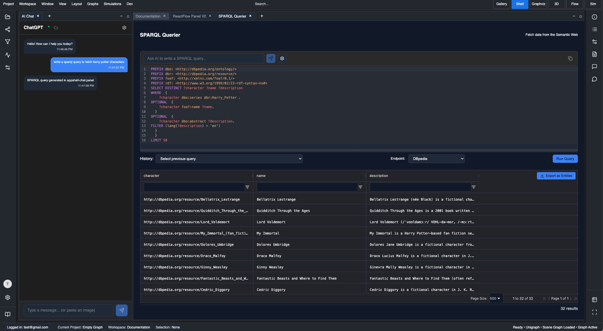
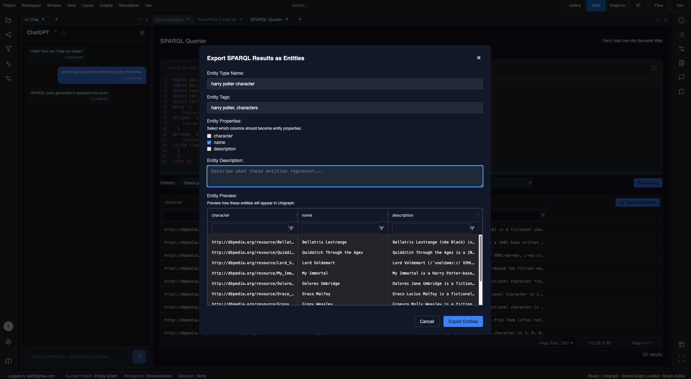
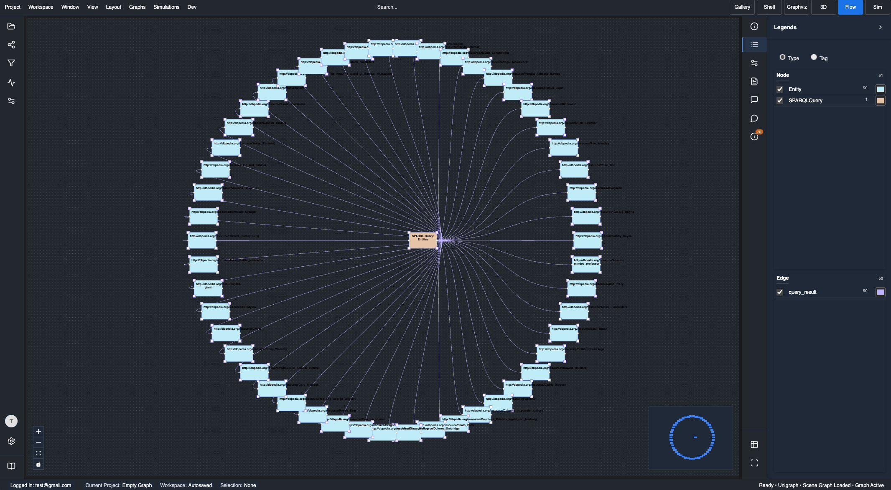

Unigraph provides an applet to write SPARQL queries and ingest data from the semantic web into Unigraph.
Logged-in users can use Copilot to assist in writing queries.

    
    

# Semantic Web Query Tool

Query semantic web data and ontologies.

## Overview

The Semantic Web Query Tool enables integration with semantic web technologies, allowing users to query RDF data, ontologies, and linked data sources.

## Query Capabilities

- SPARQL queries
- RDF data integration
- Ontology queries
- Linked data access
- Semantic reasoning

## Integration Features

- External data sources
- Ontology mapping
- Semantic annotations
- Knowledge graph integration
- Reasoning engines

## Usage

[Content to be added]
