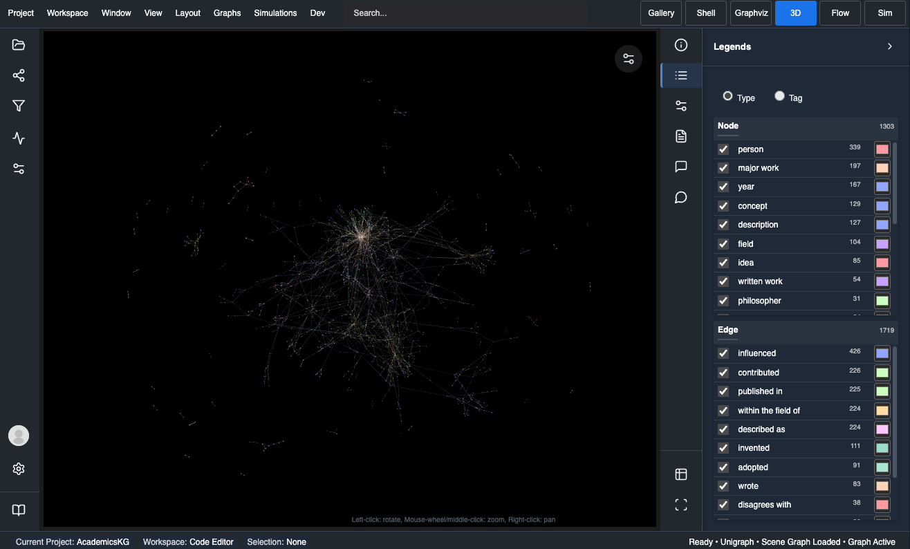

This example visualizes a collection of significant academics across history and their works, showcasing the 3D Graph View.

<iframe
  src="https://unigraph.vercel.app/?graph=AcademicsKG"
  width="100%"
  height="800px"
  style="border: none;"
>
</iframe>

<!--   
There is a legend where you can change node and edge display properties by type or tag.
 -->
